# Calendar-Planner

The calender planner webpage is designed to be interactive with the time on your computer and to be able to display saved information in the correct textboxes.

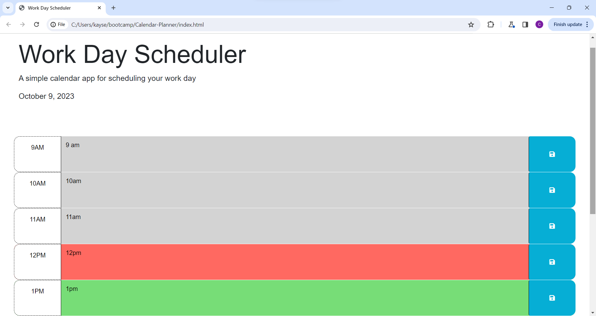

Most of the HTML is the starting code that was provided for this project, with some minor changes. Firstly the ID's for the time-block divs were changed simply the number that time would be in military time. Secondly more time-block divs were made for the amount of hours in a work day.

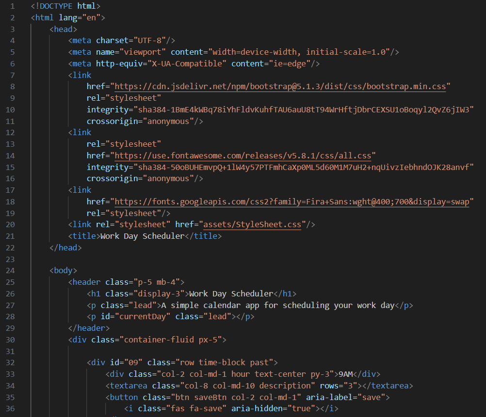
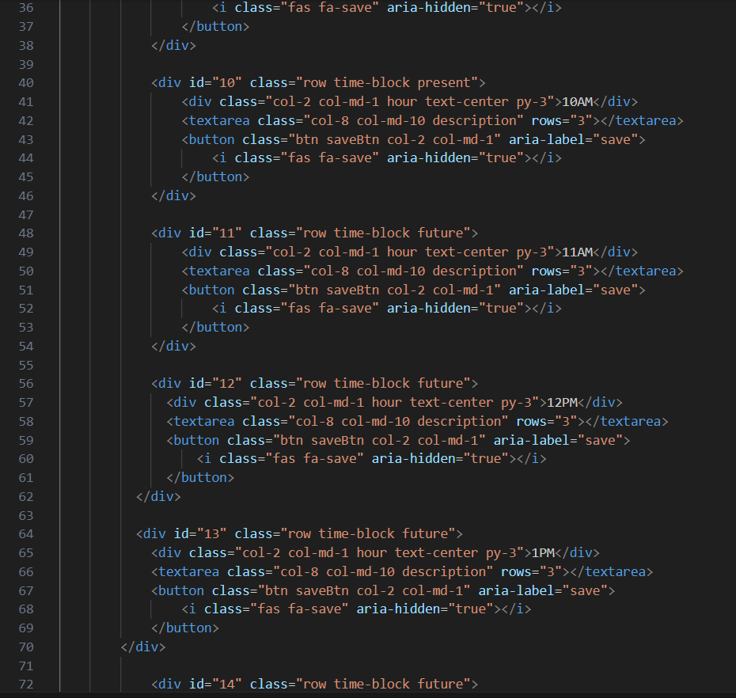
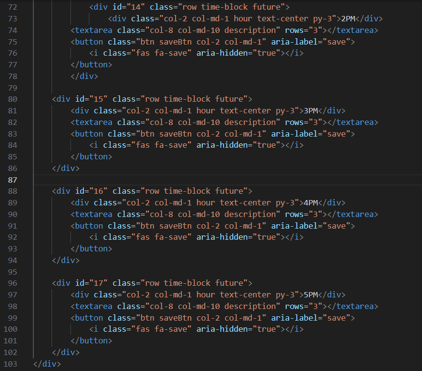
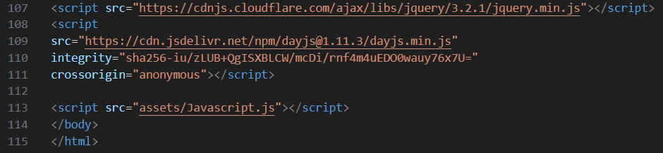

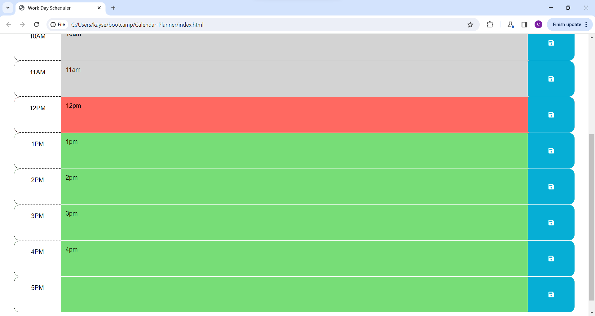

The Stylesheet is almost entirely untouched, the few things that have been changed is the border lines around the hour divs that display the hour next to the textarea, and the margin at the bottom so the page doesn't abruptly end at the list, instead there's some space.

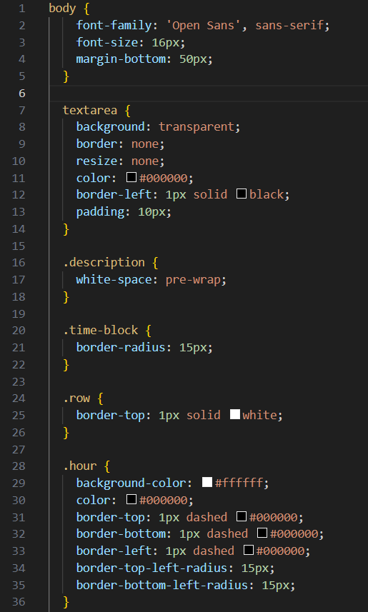
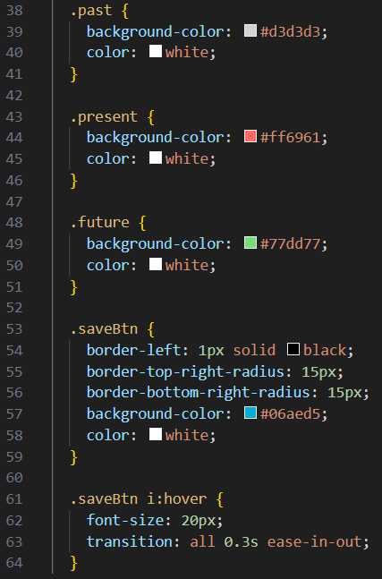

The Javascript starts with the save button function, using ".on()" to set the event listener that uses the variables, parentDiv (which grabs the closest "time-block" class which happens to be the class of the parent div for all of the time-blocks), textArea (which grabs the class value "description" inside of the parent div by using parentDiv), textAreaValue (which takes whatever value is currently in a textbox when prompted), and uniqueId (which finds the id value of the parent div, again using the parentDiv variable).
With those variables set, all the code needed to properly save the information as needed is to save textAreaValue into local storage with the proper label, which would be the uniqueId.

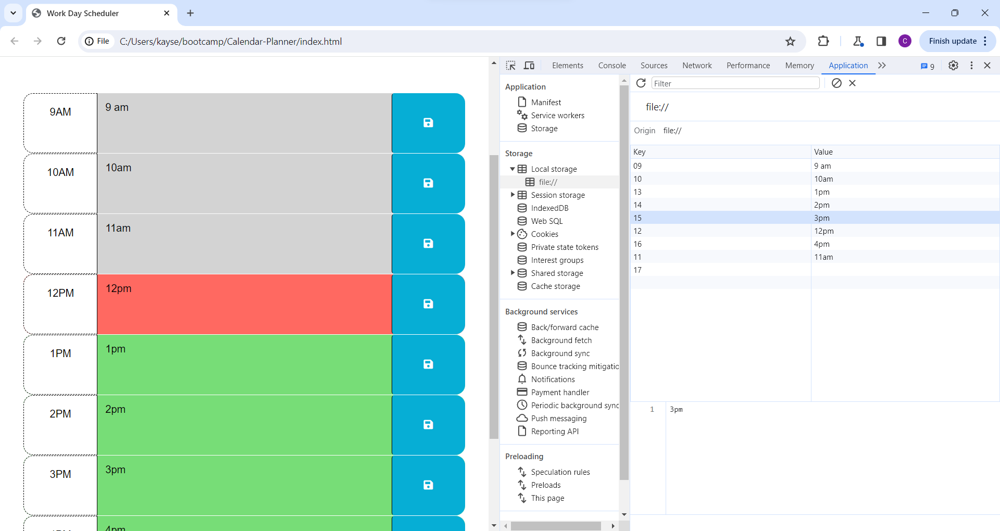

Then the code goes into the class elements regarding past, present, and future. The variable currentDate is to grab dayjs(), and then currentHour is to use the hour of the day to compare with other elements in the code.
It starts with a loop using the "each" element that will cause this set of code to loop through every time-block div with a variable set to use every div's ID which is set to the corrisponding hour in military time. It then goes through the if statements to compare the currentHour to the divID, if the value of the currentHour is higher than the divId, that div will get it's class replaced with "past", if the currentHour is less than the divId then the class will get replaced with "future". If it's neither of these the class will be replaced with "present".

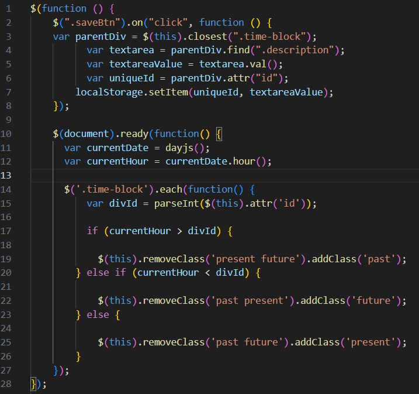

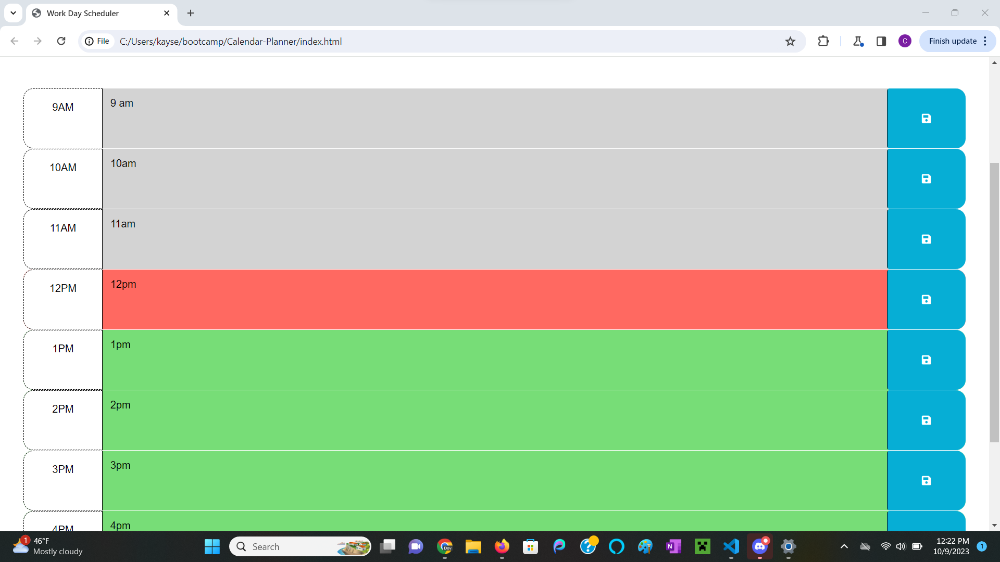
(with this image, note the time in the bottom right corner to compare with the webpage)

The next function in the javascript is to set the value of the time-block textarea's as what has been saved in local storage. It uses another each loop to go through each time-block div and uses the divId variable and saveInput variable. The divId variable grabs the ID of whichever div is being checked and the saveInput variable is grabbing the saved input in local storage. The function then runs an if statement that checks if the saveInput is null or not, and if it's not null it sets the textarea value to match the value of saveInput.

The code then ends with simply setting an empty p element with the class of "currentDay" to display the current date by month, day, year. It does this by the displayDate variable grabbing the "currentDay" class and then using that variable to set the text to the date using the dayjs API.

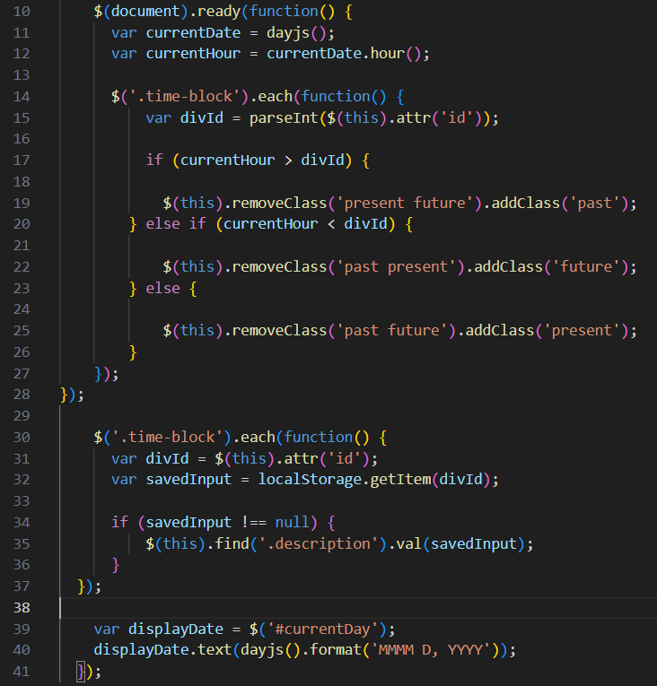